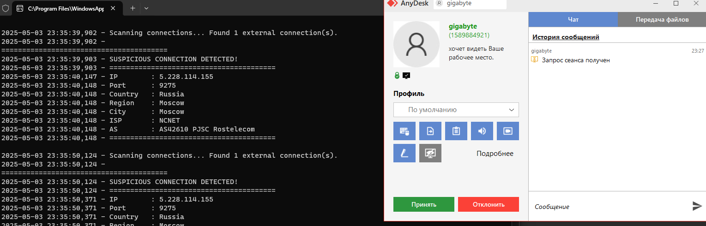

# GetIpAnydesk
**Получение IP-адреса любого, кто пытается подключиться к вашему монитору через AnyDesk (в настоящее время поддерживается только Microsoft Windows).**

Этот инструмент нужно запустить перед стартом AnyDesk, и он автоматически обнаружит и залогирует IP-адреса входящих подключений.

**(ДИСКЛЕЙМЕР)** : Данный инструмент предназначен только для личного использования. Он не предназначен для отслеживания или мониторинга кого-либо без их согласия. Перед использованием убедитесь, что вы соблюдаете местные законы и нормы, касающиеся защиты персональных данных. Несанкционированное отслеживание или логирование IP-адресов может нарушать законы о конфиденциальности.

## Руководство по установке (требуется Git)
Следуйте этим шагам для настройки проекта:

Клонируйте репозиторий:

```bash
git clone https://github.com/tuskev1ch/GetIpAnydesk
```
Перейдите в директорию проекта:
```bash
cd GetIpAnydesk
```
Установите необходимые зависимости:
```bash
py -m pip install -r requirements.txt
```
Перейдите в папку src:
```bash
cd src
```
Запустите приложение:
```bash
py main.py
```

## Возможности

✅ Автомониторинг: Программа постоянно проверяет входящие подключения AnyDesk.

✅ Сбор IP-адресов: При обнаружении попытки подключения программа автоматически получает IP-адрес клиента.

✅ Детальная информация об IP: Получает дополнительную информацию об IP-адресе, включая страну, регион, город и провайдера, а так же порт.

## Пример скриншота
Ниже приведен пример вывода при обнаружении подключения:



## Юридическое предупреждение
**Используя этот инструмент, вы подтверждаете и соглашаетесь со следующим:**

**Соблюдение конфиденциальности:** Убедитесь, что использование этого инструмента соответствует законам о защите данных в вашей юрисдикции.

**Запрет несанкционированного использования:** Не используйте этот инструмент для отслеживания или мониторинга лиц без их явного согласия. Инструмент предназначен для личного использования при обнаружении подключений к вашему устройству.

**Логирование IP-адресов:** Программа сохраняет IP-адреса попыток подключения через AnyDesk. Эти данные не передаются третьим лицам и хранятся локально на вашем устройстве.

Если вы не уверены в законности отслеживания IP-адресов в вашем регионе, перед использованием инструмента проконсультируйтесь с юристом.

Лицензия
Этот проект распространяется под лицензией MIT — подробности см. в файле LICENSE.

